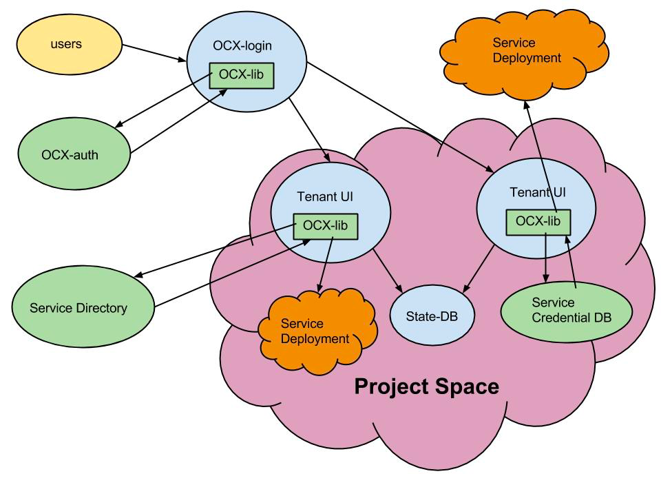

** **

## MOC-UI Project Proposal

## 1. Vision and Goals Of The Project:

MOC-UI will be the front-end UI for end-users (customers) of the Massachusetts Open Cloud ([MOC](http://www.bu.edu/hic/initiatives/massachusetts-open-cloud/)). High-Level Goals of MOC-UI include:

* Providing a simple, straightforward user experience for non-expert users

* Providing a user interface that allows users to access multiple, potentially distrusting providers offering possibly competing services

* Enabling a marketplace to show the high- (Hadoop Service, PaaS, Appliances) and low- (VMs, Storage, Computer, Networking, etc.) level customizable offerings of multiple providers

## 2. Users/Personas Of The Project

MOC-UI will be used by the end-users of MOC including researchers from BU, NU, MIT, HU and UMass, MGHPCC contributing companies, Commonwealth companies and government institutions, and paying users. 

It targets only end-users and simple use cases for non-expert users.

It does not target:

* MOC admin users, who will work against the command line.

* Administrators of cloud services, who will continue to use existing tools like Horizon.

* Advanced users with complex requirements who are expected to use command line interfaces. 

## 3. Scope and Features Of The Project:

MOC-UI 

* Presents a simple compelling interface for end-users

    * Addition and management of users of the system. 

    * User project creation and management.

        * Project add/edit/delete functionalities

        * Addition/deletion/management of low-level resources (compute, storage, network…) to/from/of the project.

            * Launching/suspending/stopping instances, accessing instances via a vnc console, adding instances to available networks.

            * Managing storage, attaching/detaching storage to instances.

            * Managing networks.

        * Addition/deletion/management of high-level resources (Hadoop, Spark, appliances…) to/from/of the project.

* Ability to operate across multiple deployments (HU, NU, BU, ...), 

* Exposes a complex marketplace of services to meet the goals of the MOC (e.g., more like Amazon's consumer marketplace). 

* Allows multiple, potentially non-trusting providers to coexist

    * Marketplace functionalities that lets selection/addition of different services/resources/appliances from different providers residing possibly in different deployments in the datacenter (e.g. storage from Harvard, compute from Northeastern) into a project. 

* Security: Provides secure storage and processing of user credentials, service and project data 

* Scalability: Can scale to large number of users, projects, and services 

* Extensibility: Provides an extendable interface that allows third-party service interaction

## 4. Solution Concept

A high-level outline of the solution…

Global Architectural Structure Of the Project and a Walkthrough:

Below is a description of the system components that are building blocks of the architectural design:

* OCX Library: library used to authenticate user credentials, create project space, accesses state and credential db, accesses service directory

* OCXi: user interface for OCX 

* OCX-login: interface for users to log into OCX and view project list

* OCX-auth: authentication server for user login

* Service-Directory: maintains all service endpoints; specific service information can be gathered from individual resources (e.g., availability, image size, SSH, CPU, price, version, name, description, etc.) 

* Service Deployment: low and high level services, can be a VM, appliance, or a high-level service (e.g. Hadoop) 

* State-DB: stores a list of the project’s purchased services

* Service Credential-DB (SC-DB): holds credentials for all project services

* Tenant-UI: project and marketplace interface 

* Project Space: virtual space for tenants (tenant ui, state db, sc-db).  These are basically VMs provisioned on top of the cloud in a project owned by the tenant. These VMs are used to handle the tenants own requests. 

**Figure 1: MOC-UI architecture.  Items that are blue are the responsibility of this project.  Green items are**** ****part of the larger OCX project, and are not the responsibility of this project.**

Figure 1 presents our global architectural design for the MOC-UI project. User credentials are authenticated by OCX-auth, an authorization server. Once a user is authenticated, either a Project-Space is created for the user or he logs-into an existing Project-Space. In both cases, a Tenant-UI (a separate VM or container) is spawned on behalf of the user and all further interactions of the user are performed via the spawned Tenant-UI. 

The Project-Space contains databases that keep track of the project state and service credentials. The Tenant-UI uses the OCX Library to acquire information on the Project-Space’s services. The OCX Library calls the Service-Directory to gather endpoints, which can be used to acquire each service’s associated information. The OCX Library manages the credentials of the associated services in the Service-Credential-DB and stores a list of the project’s purchased services in the State-DB. Using the stored endpoints, the Tenant-UI uses its API to connect with services. It must authenticate with the central authority to interact with its services. After this process, the Tenant-UI provides a marketplace of available services and a project management interface or an extensible, third party interface (e.g., Hadoop) for interaction with services.

Design Implications and Discussion

Key design decisions and motivation behind them.

* Separate Per-Tenant Project Space: The only shared central service in the system will be the login service. Upon login, system will spun-up a docker container or VM in tenant’s own project space. All subsequent interaction by a user will be with this VM. The motivations are: 1) performance isolation since different tenants interact with different services and 2) improved security since if a project space service is penetrated, only one tenant is impacted. The login and auth functionalities still need to be designed as scalable multi-tenant services, but they are much simpler and have a reduced attack surface from the full tenant UI.

* Tenant-UI accesses DBs and services using the OCX Library: In the design, all components interact with the underlying services using the OCX-library. This library exposes an interface similar to the existing OpenStack python library, but it can invoke multiple underlying OpenStack regions/deployments. For example, the interface to list all of a project’s VMs may be the same as the existing library, but it will go separately to all the Nova services that the project uses and will return an aggregate list. The interface of this library will isolate applications (such as the Tenant-UI) from changes we expect to happen to more fully support the OCX requirements in OpenStack. It will maintain a set of credentials for different OpenStack deployments (which will change when OpenStack supports federated authorization).

* Shared Service Directory: The shared service directory is part of the larger OCX project, and is not the responsibility of this project. It is being developed as a new service (rather than modifications to keystone’s existing service directory) because it needs to span multiple regions/providers… and provides a single service that different providers can advertise their services to, and users can go to to find out about all the services in an OCX.

* Project Space uses SC-DB: This is a temporary kludge until OpenStack supports federated authorization. It will allow the OCX-library to obscure from most operations that we are dealing with multiple OpenStack deployments with different credentials, and will go away once we can operate on the services using a single set of credentials. 

* Project Space uses State-DB: This DB holds the state of the Tenant-UI, so that the UI itself is stateless. New UI instances can be spun-up for each user and will synchronize by going through this DB.  

* Extensible UI: Rather than making the UI itself extensible using plugins (like horizon today), we instead assume that each service stands up its own UI and a common user experience is provided by common styling between the UIs as a user moves from one to another. This is necessary in a multi-provider cloud, since providers are not trusted to modify a shared service. 

## 5. Acceptance criteria

Minimum acceptance criteria is a single running UI that works against a single OpenStack installation. Stretch goals are:

* If the SD and ocx-library are available, to integrate with them, operate against two OS installations

* Partition the UI as discussed architecturally above into OCX- login and Tenant UI

* Addition of extensible services possibly using iframes.

## 6. Release Planning

Detailed user stories and plans are on the Trello board: https://trello.com/b/4EbylOXI/example-trello-board-for-moc-ui

Release #1 (due by Week 5): 

User stories: User creation/addition, User login/logout

User creation/addition: 

(OCX-Login) On the OCX-Login page, the user selects ‘Register’ and is sent to a registration page. 

	

	(New User Registration) 

After submitting basic information (e.g., email, password, username), the user is registered with the OCX-Authority and the user is sent to the Projects Page.

User login/logout:

(OCX-Login) User enters their credentials and selects ‘Login’

(Projects Page) User views his list of projects plus project descriptions, selects a project space, and clicks enter, a Tenant-UI VM is spawned in the capacity of the selected project on users behalf and user is redirected to the spawned Tenant-UI.

(Project Space) User lands on the Project Management page and clicks logout, his Tenant-UI VM is deallocated.

Release #2 (due by Week 7): 

Project creation/deletion:

…

Release #3 (due by Week 9): 

Addition/modification/deletion of a VM into/in/from a Project:

…

Release #4 (due by Week 11):

Console access to active VMs (due by: Week 10):

…

Release #5 (due by Week 13):

Addition/usage/modification of extensible services such as Hadoop/Spark:

(Project Management) The user decides to add a Service on project management page, selects ‘Marketplace’ tab, then user selects a Service (HPC, Hadoop, Protein Modeling, etc.), chooses from a list of possible configuration options (Size, Speed, Network) 

(Project Management) User selects a Service 

(Service Details) (Overlay) User selects manage service option, which opens Service Interface (e.g. Hadoop’s native interface)

(Service Interface) User interacts with Service Interface (3rd party interface running in a panel)

